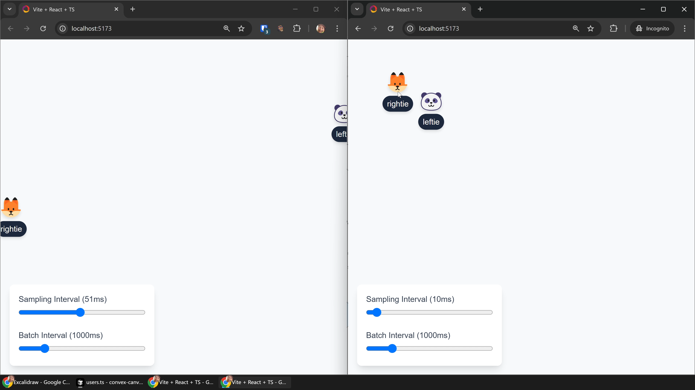

# Convex Realtime Cursors Demo

Showing a cool trick for faking high frequency realtime updates on a serverless platform like Convex.

This repo is to go along with a video that was produced on the topic here: https://youtu.be/Tx_YIN-87_M

## Setup

1. Install deps

```
bun install
```

2. Start developing

```
bun dev
```
